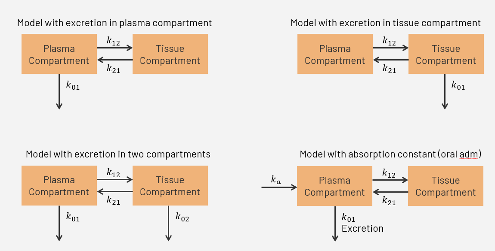

# Where is the math in the Two Compartment Open Model? by Julio Hernández Reyes

Welcome! This repository presents my mathematical modeling project exploring how pharmacokinetic models, specifically the **two compartment open model**, describe drug movement through the body.

**Note:** I will focus **exclusively on the theoretical background and mathematical derivation** of the equations that govern the model. It does not include experimental or clinical data, but instead highlights the math behind how we understand drug distribution in the body. :)

---

## Personal Information

Hi! I'm Julio Hernández Reyes, a Chemistry major student with a minor in Mathematics at Arkansas State University Campus Queretaro (ASUCQ). Up to now, I already finished all the Chemistry courses and have taken the majority of math courses offered by the institution (Calculus 1 2 and 3; Linear Algebra & Differential Equations). I find really enjoyable Organic and Inorganic Chemistry and some of the connections they have with other fields. 

## Introduction

After taking the course Introduction to Pharmacology, I got interested in how pharmacokinetics work. Nonetheless, due to time constraints and because it is an introductory course, the graphs of the model were only shown without a true understanding of the math behind them. Now that I have the opportunity, I would like to see the how math describe the biological or chemical processes that are happening in drug distribution, how the equation of the model is obtained and how are the pharmacokinetic parameters obtained.

Here is the link to the [Motivational Video](https://www.youtube.com/watch?v=WnimfMnryds)

Here is the link to the [Video Presenting Classmates]()

## Hands On

As stated in the [Video Presenting Classmates](), the basic idea of the model is to keep track of the amount of drug that goes inside and ouside the compartments as time passes. This behavior is shown in the following equation:

$$
\frac{dC_n}{dt}=Input\space rate\space of\space drug-Output\space rate\space of\space drug
$$

where $$C_n$$ refers to the compartment that is being described, either the central/plasma compartment or the peripheral/tissue compartment.

### Variety of Models

Depending on the route of administration of the drug (oral, injection, infusion, etc.) and the excretion of the drug (urine or sweat mainly), the representation of the model may vary. For instance, oral administration will have an extra constant when compared to IV. Some models mention that excretion only occurs in the central compartment, while others affirm that excretion happens in the tissue compartment or  even a combination of both compartments. So, as you can see, this model is versatile since it allows to take these factors (administration and excretion) into consideration.

### Model Assumptions and Limitations

**Assumptions**

1.- The body is represented by two compartments.

2.- Once a drug enters a compartment, it mixes instantly and homogenously.

3.- Drug movement between compartments and elimination from the central compartment follow first-order kinetics: 𝑅𝑎𝑡𝑒∝𝐴𝑚𝑜𝑢𝑛𝑡 𝑜𝑟 𝑐𝑜𝑛𝑐𝑒𝑛𝑡𝑟𝑎𝑡𝑖𝑜𝑛 𝑜𝑓 𝑑𝑟𝑢𝑔

4.- The drug is eliminated only from the central compartment.

5.- The entire dose is injected directly into the central compartment at t=0.

**Limitations**

1.- Nonlinear (Michaelis-Menten) kinetics

2.- The model starts drug distribution immediately, but some drugs exhibit distribution delays.

3.- Saturation effects and metabolism

### Two Compartment Open Model for IV Bolus Dose

For the IV bolus dose, the visualization of the model looks as follows:

Based on that, the system of differential equations that model the amount of drug present in each compartment are given by:

$$\frac{dC_p}{dt}=k_{21}C_t-(k_{01}+k_{12})C_p \quad \text{(1)}$$

$$\frac{dC_t}{dt}=k_{12}C_p-k_{21}C_t \quad \text{(2)}$$

where $$C_p$$ is the plasma compartment and $$C_t$$ is the tissue compartment.

### Mathematical derivation

There are multiple ways to solve this system of differential equations (Laplace transform or Eigenvalue decomposition), yet solving by substitution is easier since only algebra is mostly required.

First, you take the derivative of Equation 1 with respect to time and arrange all the terms that contain $$C_p$$ to one side of the equation.

$$\frac{d^2C_p}{dt^2}+(k_{01}+k_{12})\frac{dC_p}{dt}=k_{21}\frac{dC_t}{dt} \quad \text{(3)}$$

From Equation 2 you have the expression that corresponds to $$\frac{dC_t}{dt}$$, so you substitute it in Equation 3 to obtain:

$$\frac{d^2C_p}{dt^2}+(k_{01}+k_{12})\frac{dC_p}{dt}=k_{21}(k_{12}C_p-k_{21}C_t)$$

$$\frac{d^2C_p}{dt^2}+(k_{01}+k_{12})\frac{dC_p}{dt}=k_{21}k_{12}C_p-k_{21}^2C_t \quad \text{(4)}$$

Now, from Equation 1, clear for $$C_t$$. 

$$\frac{dC_p}{dt}+(k_{01}+k_{12})C_p=k_{21}C_t$$

$$\frac{1}{k_{21}} \left( \frac{dC_p}{dt}+(k_{01}+k_{12})C_p \right)=C_t$$ 

Substitute the value of $$C_t$$ in Equation 4 and simplify terms.

$$\frac{d^2C_p}{dt^2}+(k_{01}+k_{12})\frac{dC_p}{dt}=k_{21}k_{12}C_p-k_{21}^2 \left( \frac{1}{k_{21}} \left( \frac{dC_p}{dt}+(k_{01}+k_{12})C_p \right) \right)$$

$$\frac{d^2C_p}{dt^2}+(k_{01}+k_{12})\frac{dC_p}{dt}=k_{21}k_{12}C_p-k_{21} \left( \frac{dC_p}{dt}+(k_{01}+k_{12})C_p \right)$$

$$\frac{d^2C_p}{dt^2}+(k_{01}+k_{12})\frac{dC_p}{dt}=k_{21}k_{12}C_p-k_{21}\frac{dC_p}{dt}-k_{21}(k_{01}+k_{12})C_p$$

$$\frac{d^2C_p}{dt^2}+(k_{01}+k_{12})\frac{dC_p}{dt}=k_{21}k_{12}C_p-k_{21}\frac{dC_p}{dt}-k_{21}k_{01}C_p-k_{21}k_{12}C_p$$

$$\frac{d^2C_p}{dt^2}+(k_{01}+k_{12})\frac{dC_p}{dt}=-k_{21}\frac{dC_p}{dt}-k_{21}k_{01}C_p$$

By passing all the remaining terms to the other side and making the equation equal to zero we obtain:

$$\frac{d^2C_p}{dt^2}+(k_{01}+k_{12})\frac{dC_p}{dt}+k_{21}\frac{dC_p}{dt}+k_{21}k_{01}C_p=0$$

Factorizing the remaining terms, we obtain the second order differential equation that is needed to be solved to find the equation of the model

$$\frac{d^2C_p}{dt^2}+(k_{01}+k_{12}+k_{21})\frac{dC_p}{dt}+k_{21}k_{01}C_p=0$$

Since all the $$k_n$$ are microconstants, we can create two hybrid constants ($$\alpha$$ and $$\beta$$) to simplify the model. In this case:

$$k_{01}+k_{12}+k_{21}=\alpha + \beta$$

$$k_{21}k_{10}=\alpha \beta$$

And thus, the new equation looks as:

$$\frac{d^2C_p}{dt^2}+(\alpha+\beta)\frac{dC_p}{dt}+ \alpha \beta C_p=0$$

Now, we can reduce the second order differential equation into a cuadratic equation (known as characteristic equation) to find the solution

$$r^2+(\alpha+\beta)r+ \alpha \beta=0$$

Finally, recall that $$(x+a)(x+b)=x^2+(a+b)x+ab$$. So, the roots of the cuadratic equation are:

$$(r + \alpha )(r + \beta )$$

Since we have two real and distinct roots, the solution to the second order differential equation is:

$$C_p(t)=Ae^{-\alpha t}+Be^{-\beta t}$$

## Summary and Conclusions

## References
