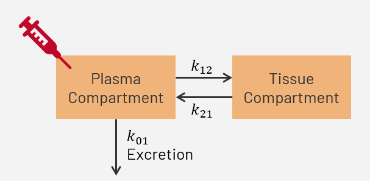

# Where is the math in the Two Compartment Open Model? by Julio Hernández Reyes

Welcome! This repository presents my mathematical modeling project exploring how pharmacokinetic models, specifically the **two compartment open model**, describe drug movement through the body.

**Note:** I will focus **exclusively on the theoretical background and mathematical derivation** of the equations that govern the model. It does not include experimental or clinical data, but instead highlights the math behind how we understand drug distribution in the body. :)

---

## Personal Information

Hi! I'm Julio Hernández Reyes, a Chemistry major student with a minor in Mathematics at Arkansas State University Campus Queretaro (ASUCQ). Up to now, I already finished all the Chemistry courses and have taken the majority of math courses offered by the institution (Calculus 1 2 and 3; Linear Algebra & Differential Equations). I find really enjoyable Organic and Inorganic Chemistry and some of the connections they have with other fields. 

## Introduction

After taking the course Introduction to Pharmacology, I got interested in how pharmacokinetics work. Nonetheless, due to time constraints and because it is an introductory course, the graphs of the model were only shown without a true understanding of the math behind them. Now that I have the opportunity, I would like to see the how math describe the biological or chemical processes that are happening in drug distribution, how the equation of the model is obtained and how are the pharmacokinetic parameters obtained.

Here is the link to the [Motivational Video](https://www.youtube.com/watch?v=WnimfMnryds)

Here is the link to the [Video Presenting Classmates](https://youtu.be/bwfhQW6KAQg)

## Hands On

As stated in the [Video Presenting Classmates](), the basic idea of the model is to keep track of the amount of drug that goes inside and ouside the compartments as time passes. This behavior is shown in the following equation:

$$
\frac{dC_n}{dt}=Input\space rate\space of\space drug-Output\space rate\space of\space drug
$$

where $C_n$ refers to the compartment that is being described, either the central/plasma compartment or the peripheral/tissue compartment.

### Variety of Models

Depending on the route of administration of the drug (oral, injection, infusion, etc.) and the excretion of the drug (urine or sweat mainly), the representation of the model may vary. For instance, oral administration will have an extra constant when compared to IV. Some models mention that excretion only occurs in the central compartment, while others affirm that excretion happens in the tissue compartment or  even a combination of both compartments. So, as you can see, this model is versatile since it allows to take these factors (administration and excretion) into consideration.

### Model Assumptions and Limitations

**Assumptions**

1. The body is divided into a central compartment (blood and highly perfused organs) and a peripheral compartment (poorly perfused tissues like fat and muscle)

2. Once a drug enters a compartment, it mixes instantly and homogenously.

3. Drug movement between compartments and elimination from the central compartment follow first-order kinetics: $$Rate \propto Concentration \space of \space drug$$

**Limitations**

1. This model does not account for any other type of kinetics. Therefore, it is not linear, then the model will fail.

2. The model assumes instantaneous distribution, but some drugs have a slow equilibration phase with tissues. Additionally, blood flow and tissue binding can cause non-uniform drug distribution which is somethimg that the model does not account for.

3. The model ignores saturation of transporters or plasma protein binding, which can alter drug distribution.

---

### Two Compartment Open Model for IV Bolus Dose

For the IV bolus dose, the visualization of the model looks as follows:

> Based on that, the system of differential equations that model the amount of drug present in each compartment are given by:
> 
> $$
\begin{align*}
& \frac{dC_p}{dt}=k_{21}C_t-(k_{01}+k_{12})C_p    &    \qquad \text{(1)} \\
\\
& \frac{dC_t}{dt}=k_{12}C_p-k_{21}C_t             &    \qquad \text{(2)}
\end{align*}
$$
>
> where $C_p$ is the plasma compartment and $C_t$ is the tissue compartment.

### Mathematical derivation

There are multiple ways to solve this system of differential equations (Laplace transform or Eigenvalue decomposition), yet solving by the method of elimination is easier since only algebra is mostly required. The main idea behind the method is to tranform the systenm of differential equations into a second order differential equation  and then find the solution of that ODE.

* First, take the derivative of Equation 1 with respect to time and arrange all the terms that contain $C_p$ to one side of the equation.

$$\frac{d^2C_p}{dt^2}+(k_{01}+k_{12})\frac{dC_p}{dt}=k_{21}\frac{dC_t}{dt} \quad \text{(3)}$$

* From Equation 2, the expression corresponds to $\frac{dC_t}{dt}$. Substitute it in Equation 3 to obtain:
  
$$
\begin{align*}
& \frac{d^2C_p}{dt^2}+(k_{01}+k_{12})\frac{dC_p}{dt}=k_{21}(k_{12}C_p-k_{21}C_t) \\
\\
& \frac{d^2C_p}{dt^2}+(k_{01}+k_{12})\frac{dC_p}{dt}=k_{21}k_{12}C_p-k_{21}^2C_t  &  \quad \text{(4)}
\end{align*}
$$

* From Equation 1, clear for $C_t$.
  
$$
\begin{align*}
& \frac{dC_p}{dt}+(k_{01}+k_{12})C_p=k_{21}C_t \\
\\
& \frac{1}{k_{21}} \left( \frac{dC_p}{dt}+(k_{01}+k_{12})C_p \right)=C_t 
\end{align*}
$$

* Substitute the value of $C_t$ in Equation 4 and simplify terms.

$$
\begin{align*}
& \frac{d^2C_p}{dt^2}+(k_{01}+k_{12})\frac{dC_p}{dt}=k_{21}k_{12}C_p-k_{21}^2 \left( \frac{1}{k_{21}} \left( \frac{dC_p}{dt}+(k_{01}+k_{12})C_p \right) \right) \\
\\
& \frac{d^2C_p}{dt^2}+(k_{01}+k_{12})\frac{dC_p}{dt}=k_{21}k_{12}C_p-k_{21} \left( \frac{dC_p}{dt}+(k_{01}+k_{12})C_p \right) \\
\\
& \frac{d^2C_p}{dt^2}+(k_{01}+k_{12})\frac{dC_p}{dt}=k_{21}k_{12}C_p-k_{21}\frac{dC_p}{dt}-k_{21}(k_{01}+k_{12})C_p \\
\\
& \frac{d^2C_p}{dt^2}+(k_{01}+k_{12})\frac{dC_p}{dt}=k_{21}k_{12}C_p-k_{21}\frac{dC_p}{dt}-k_{21}k_{01}C_p-k_{21}k_{12}C_p \\
\\
& \frac{d^2C_p}{dt^2}+(k_{01}+k_{12})\frac{dC_p}{dt}=-k_{21}\frac{dC_p}{dt}-k_{21}k_{01}C_p
\end{align*}
$$

* By passing all the remaining terms to the other side and making the equation equal to zero we obtain:

$$\frac{d^2C_p}{dt^2}+(k_{01}+k_{12})\frac{dC_p}{dt}+k_{21}\frac{dC_p}{dt}+k_{21}k_{01}C_p=0$$

* Factorizing the remaining terms, a second order differential equation is obtained and will be solved to find the equation of the model

$$\frac{d^2C_p}{dt^2}+(k_{01}+k_{12}+k_{21})\frac{dC_p}{dt}+k_{21}k_{01}C_p=0$$

> Since all $k_n$ are microconstants,  two hybrid constants ($\alpha$ and $\beta$) are created to simplify the model. In this case:
> 
> $$k_{01}+k_{12}+k_{21}=\alpha + \beta $$
> 
> $$k_{21}k_{10}=\alpha \beta $$

* And thus, the new equation looks as:

$$\frac{d^2C_p}{dt^2}+(\alpha+\beta)\frac{dC_p}{dt}+ \alpha \beta C_p=0$$

* Reduce the second order differential equation into a cuadratic equation (known as characteristic equation) to find the solution

$$r^2+(\alpha+\beta)r+ \alpha \beta=0$$

* Finally, recall that $$(x+a)(x+b)=x^2+(a+b)x+ab$$. So, the roots of the cuadratic equation are:

$$(r + \alpha )(r + \beta )$$

> Two real and distinct roots appear, so the solution to the second order differential equation is:
>
> $$C_p(t)=Ae^{-\alpha t}+Be^{-\beta t}$$

**Note:** Once the equation for $C_p$ was found, you can easily solve for the tissue compartment but it is not commonly done since the relevant biological and pharmacokinetic processes occur mostly in the plasma compartment. 

The values for $A$ and $B$ can be estimated by applying the initial conditions in equations 1 and 2.

### Constants A, B and Initial Conditions

> This model assumes that at $t=0$:
> 
> $C_p(t)=D$
>
> $C_t(t)=0$
>
> where $D$ is the initial dose administered.

To find the value of $A$ and $B$, the following steps can be followed:

* Apply t=0 in $C_p(t)$ and apply the first condition where $C_p(t)=D$

$$
\begin{align*}
& C_p(0)=Ae^{-\alpha (0)}+Be^{-\beta (0)} \\
\\
& C_p(0)=A+B \\
\\
& C_p(0)=D \\
\\
& D=A+B
\end{align*}
$$

* Substitute the initial conditions on equations 1 and 2

$$
\begin{align*}
& C_p'(0)=k_{21}(0)-(k_{01}+k_{12})D \\
\\
& C_t'(0)=k_{12}D-k_{21}(0)
\end{align*}
$$

$$
\begin{align*}
& C_p'(0)=-(k_{01}+k_{12})D  &  \text{(5)}\\
\\
& C_t'(0)=k_{12}D
\end{align*}
$$

* Since $C_p$ is known, take the first derivative of it, substitute it in equation 5 and look for $C_p'$ when $t=0$

$$
\begin{align*}
& C_p'(t)=-\alpha Ae^{-\alpha t}-\beta Be^{-\beta t} \\
\\
& C_p'(0)=-\alpha Ae^{-\alpha (0)}-\beta Be^{-\beta (0)} \\
\\
& C_p'(0)=-\alpha A-\beta B \\
\\
& -\alpha A-\beta B=-(k_{01}+k_{12})D \\
\\
& \alpha A+\beta B=(k_{01}+k_{12})D \\
\end{align*}
$$

> Now a system of equations appear considering $C_p(0)$ and $C_p'(0)$
>
>$$
\begin{align*}
& A+B=D \\
\\
& \alpha A+\beta B=(k_{01}+k_{12})D
\end{align*}
$$

* Solving the system:

$$
\begin{align*}
& B=D-A \\
\\
& \alpha A+\beta (D-A)=(k_{01}+k_{12})D \\
\\
& \alpha A+\beta D-\beta A=(k_{01}+k_{12})D \\
\\
& A(\alpha -\beta)+\beta C=(k_{01}+k_{12})D \\
\\
& A(\alpha -\beta)=(k_{01}+k_{12})D - \beta D \\
\\
& A(\alpha -\beta)=(k_{01}+k_{12}-\beta )D
\end{align*}
$$

* Recall that $k_{01}+k_{12}+k_{21}=\alpha + \beta$. Therefore, $k_{01}+k_{12}-\beta=\alpha -k_{21}$

$$
\begin{align*}
& A(\alpha -\beta)=(\alpha -k_{21})D \\
\\
& A=\frac{(\alpha -k_{21})D}{\alpha -\beta} \\
\end{align*}
$$

* Finally, clear for B

$$
\begin{align*}
& \frac{(\alpha -k_{21})D}{\alpha -\beta}+B=D \\
\\
& B=D-\frac{(\alpha -k_{21})D}{\alpha -\beta} \\
\\
& B=\frac{(\alpha -\beta )D-(\alpha-k_{21})D}{\alpha -\beta} \\
\\
& B=\frac{(\alpha -\beta -\alpha+k_{21})D}{\alpha -\beta} \\
\\
& B=\frac{(k_{21}-\beta )D}{\alpha -\beta} \\
\end{align*}
$$

### Model Visualization

The following image illustrates the typical plasma concentration ($$C_p$$) versus time profiles for a drug. In panel (a), where the y-axis is on a normal scale, the curve shows a rapid initial decline followed by a slower decrease in drug concentration over time. This biexponential behavior becomes more evident in panel (b), where the y-axis is plotted on a logarithmic scale. The curve now clearly separates into two distinct linear segments: the first corresponds to the distribution or $$\alpha$$ phase, where the drug rapidly distributes from the central (plasma) compartment to the peripheral compartment (tissues); the second, more gradual slope represents the post-distribution or $$\beta$$ phase, during which the drug is eliminated primarily from the central compartment. This biphasic profile is characteristic of two-compartment kinetics and reflects both the initial redistribution and the eventual elimination processes that govern drug behavior in the body after IV bolus administration.

## Conclusions

This project examines the theoretical framework of the two-compartment open pharmacokinetic model. I derived and studied the differential equations that govern drug transfer between the central and peripheral compartments, highlighting how exponential terms describe concentration–time profiles. Because the timeline was short—about one month—I focused on the derivation itself and did not explore parameter-estimation methods or full PK calculations. I first considered a different, more complex topic (Density Functional Theory), but soon realized it would not fit the schedule. After searching for a chemistry-related alternative, I chose this model. To tackle it, I reviewed ideas from precalculus, differential equations, and pharmacology, gathered papers on solving linear ODE systems, and worked through the algebra by hand. When a step was unclear, I asked Deepseek to break it into smaller pieces so I could explain each part with confidence.

My coursework had already given me a solid foundation in calculus and reaction kinetics, and pharmacology had shown me the typical shape of concentration curves, though I had never seen where the equations came from. Tracing those curves back to their source was enriching, as was learning how the rate constants $$k_{01​}$$, $$k_{12}$$​, and $$k_{21}$$​ and the hybrid constants $$\alpha$$ and $$\beta$$ reflect real transport processes. Grasping the switch from the original rate constants to the hybrid ones took extra effort, and losing a week while I changed topics made time management harder. Additionaly, adapting the material for classmates who are not chemists added another challenge.

Despite these obstacles, I really enjoyed the project. It deepened a concept I first met in Intro to Pharmacology and showed how mathematics clarifies biochemical behaviour. Next, I hope to implement numerical solutions in Python and compare them with reported PK values for drugs.

## References

* These two papers are the ones I initially found and are the main reason of why I chose this topic to work with.

  1. Shenoy, P., Joslin D’Souza, Rao, M., Shreesha Chokkadi, & Salins, N. (2023). Mathematical Models to Compare the Pharmacokinetics of Methadone, Buprenorphine, Tramadol, and Tapentadol. Eng. Proc., 59(1), 55. https://doi.org/10.3390/engproc2023059055

  2. Shenoy, P., Rao, M., Shreesha Chokkadi, Bhatnagar, S., & Salins, N. (2024). Developing mathematical models to compare and analyse the pharmacokinetics of morphine and fentanyl. Indian Journal of Anaesthesia, 68(1), 111–117. https://doi.org/10.4103/ija.ija_1036_23

* These two sites were used for the theoretical background and also helped a little with the mathematical derivation

  3. Pharmd Guru. (2022, March 16). 8. MULTI COMPARTMENT MODELS. PHARMD GURU. https://pharmdguru.com/multi-compartment-models/

  4. Rohilla, S. (2020). Two compartment open model sulekhappt.x.1. SlideShare; Slideshare. https://es.slideshare.net/slideshow/two-compartment-open-model-sulekhapptx1/233206136

* The last images were extracted from the following presentation

  5. Saleh, M. I. (2016). Two-compartment model. Slideplayer.com. https://slideplayer.com/slide/5301703/

* Finally, this video helped me to see how tha system could be solved by elimination without recurring to Laplace transforms or matrices

  6. The Math Tutor. (2020, December 1). Elimination Method to Solve a System of ODEs | Differential Equation | OGE. YouTube. https://www.youtube.com/watch?v=POc_8zIIZIo
